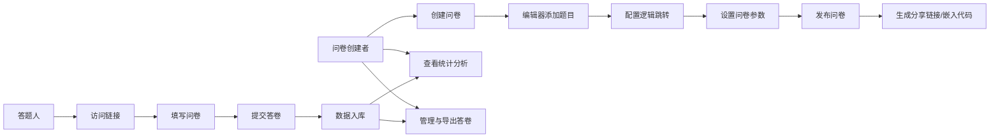

## 1. 产品概述

在线问卷设计与收集系统，支持问卷创建、编辑、分发、数据收集与统计分析的全流程管理。

- 面向问卷创建者和答题人两类用户，解决传统纸质问卷效率低、统计难的问题
- 提供丰富题型、逻辑跳转、数据分析、条件筛选与导出等企业级功能

## 2. 核心功能

### 2.1 用户角色
| 角色 | 核心权限 |
|------|----------|
| 问卷创建者 | 创建、编辑、发布问卷；查看统计；管理答卷；设置分享 |
| 答题人 | 通过链接或嵌入页面填写并提交问卷 |

### 2.2 功能模块
1. **问卷列表页**：问卷卡片展示、创建问卷、搜索、管理入口
2. **问卷编辑器**：题目编辑、题型选择、选项配置、逻辑跳转设置
3. **问卷设置页**：时间范围、人数上限、访问密码
4. **答题页面**：问卷展示、逻辑跳转、提交验证
5. **统计分析页**：各题目统计图表、选项占比、平均分
6. **答卷管理页**：答卷列表、条件筛选、Excel导出
7. **分享页面**：独立链接生成、iframe嵌入代码

### 2.3 页面详情
| 页面名称 | 模块名称 | 功能描述 |
|-----------|-------------|---------------------|
| 问卷列表页 | 问卷卡片网格 | 展示问卷标题、状态、答卷数、创建时间 |
| 问卷列表页 | 创建问卷弹窗 | 输入标题快速创建空白问卷 |
| 问卷编辑器 | 题型工具栏 | 6种题型：单选、多选、下拉、文本、评分、矩阵 |
| 问卷编辑器 | 题目编辑区 | 拖拽排序、编辑题干、添加/删除选项 |
| 问卷编辑器 | 逻辑跳转配置 | 根据选项值显示或跳过指定题目 |
| 问卷设置页 | 基础设置 | 开始时间、截止时间日期选择器 |
| 问卷设置页 | 安全设置 | 人数上限输入、访问密码设置 |
| 答题页面 | 问卷展示 | 按逻辑渲染可见题目，支持翻页 |
| 答题页面 | 提交验证 | 必填校验、密码校验、人数/时间校验 |
| 统计分析页 | 图表区 | 饼图/柱状图展示选项占比，评分展示平均分 |
| 答卷管理页 | 筛选面板 | 按题目选项条件筛选答卷 |
| 答卷管理页 | 导出按钮 | 导出当前筛选结果为Excel |
| 分享页面 | 链接展示 | 复制独立答题链接 |
| 分享页面 | iframe代码 | 展示并复制嵌入代码 |

## 3. 核心流程

问卷创建者从列表页创建问卷，进入编辑器添加题目并配置逻辑跳转，设置问卷参数后发布。答题人通过分享链接或嵌入页面填写问卷，提交后数据实时同步至后台。创建者可在统计分析页查看数据图表，在答卷管理页筛选并导出数据。

## 4. 用户界面设计

### 4.1 设计风格
- **主色调**：深靛蓝 `#1e3a8a` 搭配青碧色 `#06b6d4` 作为强调色
- **中性色**：以 slate 灰阶为基础，背景 `#f8fafc`，卡片纯白
- **按钮风格**：圆润胶囊形，主按钮带渐变与微光阴影
- **字体**：标题使用 Noto Serif SC 体现专业感，正文使用系统无衬线字体
- **布局**：顶部导航 + 卡片网格，编辑器采用左右分栏布局
- **图标风格**：使用 Lucide 线性图标，统一 20px 尺寸

### 4.2 页面设计概述
| 页面名称 | 模块名称 | UI元素 |
|-----------|-------------|-------------|
| 问卷列表页 | 顶部导航 | 品牌logo、创建按钮、用户头像 |
| 问卷列表页 | 搜索与过滤 | 搜索框、状态筛选标签 |
| 问卷列表页 | 问卷卡片 | 封面色、标题、状态徽章、答卷数、操作菜单 |
| 问卷编辑器 | 左侧题型面板 | 6个题型卡片带图标和名称 |
| 问卷编辑器 | 中间编辑区 | 题目卡片列表，拖拽排序，编辑浮层 |
| 问卷编辑器 | 右侧属性面板 | 题目属性、必填开关、逻辑跳转配置 |
| 答题页面 | 问卷头部 | 问卷标题、描述、进度条 |
| 答题页面 | 题目列表 | 逐题展示，带淡入动画 |
| 统计分析页 | 总览卡片 | 答卷数、完成率、平均时长 |
| 统计分析页 | 图表列表 | 每题独立卡片，内嵌图表组件 |

### 4.3 响应性
- 桌面端优先设计，≥1024px 完整展示
- 平板端（768-1024px）：编辑器面板折叠为抽屉
- 移动端（<768px）：答题页面单列布局，编辑器隐藏左侧面板
- 所有交互元素支持 touch 操作，最小点击区域 44px
