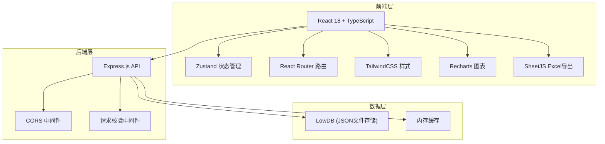
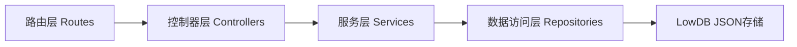
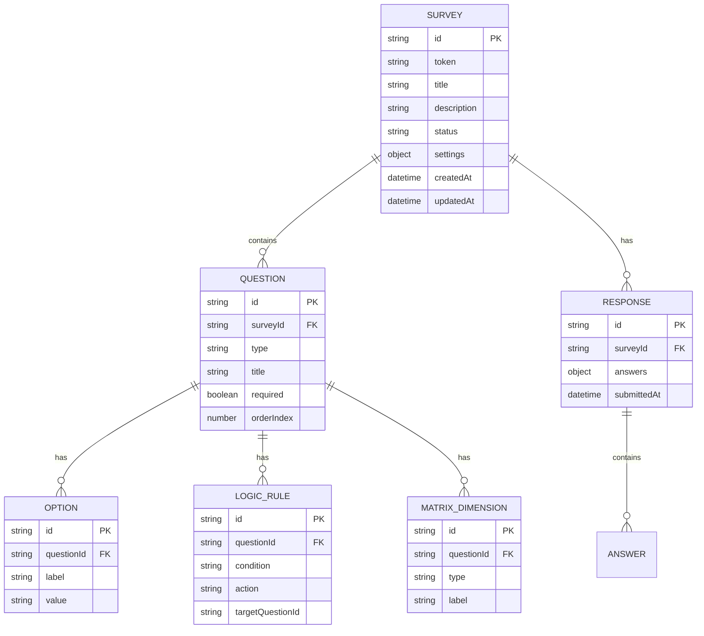

## 1. 架构设计



## 2. 技术描述
- 前端：React@18 + TypeScript + Vite@5 + TailwindCSS@3 + Zustand@4
- 路由：react-router-dom@6
- 后端：Express@4 + TypeScript
- 图表：recharts@2
- Excel导出：xlsx@0.18
- 图标：lucide-react@0.344
- 数据库：lowdb@7（JSON文件存储，方便原型演示）
- HTTP客户端：fetch API（原生）

## 3. 路由定义
| 路由 | 用途 |
|-------|---------|
| / | 问卷列表首页 |
| /survey/create | 创建问卷并重定向到编辑器 |
| /survey/:id/edit | 问卷编辑器 |
| /survey/:id/settings | 问卷设置 |
| /survey/:id/analytics | 统计分析 |
| /survey/:id/responses | 答卷管理 |
| /survey/:id/share | 分享设置 |
| /s/:token | 独立答题页面 |
| /embed/:token | iframe嵌入答题页面 |

## 4. API定义

### 类型定义
```typescript
// 题目类型
type QuestionType = 'single' | 'multiple' | 'dropdown' | 'text' | 'rating' | 'matrix';

// 选项
interface Option {
  id: string;
  label: string;
  value: string;
}

// 矩阵题行列
interface MatrixDimension {
  id: string;
  label: string;
}

// 逻辑跳转规则
interface LogicRule {
  id: string;
  questionId: string;
  condition: 'equals' | 'not_equals' | 'contains' | 'not_contains';
  value: string | string[];
  action: 'show' | 'skip';
  targetQuestionId: string;
}

// 题目
interface Question {
  id: string;
  type: QuestionType;
  title: string;
  required: boolean;
  options?: Option[];
  maxRating?: number;
  rows?: MatrixDimension[];
  columns?: MatrixDimension[];
  logic?: LogicRule[];
}

// 问卷
interface Survey {
  id: string;
  token: string;
  title: string;
  description: string;
  status: 'draft' | 'published' | 'closed';
  questions: Question[];
  settings: {
    startTime: string | null;
    endTime: string | null;
    maxResponses: number | null;
    password: string | null;
  };
  createdAt: string;
  updatedAt: string;
}

// 答卷
interface Response {
  id: string;
  surveyId: string;
  answers: Record<string, any>;
  submittedAt: string;
  respondentIp: string;
}
```

### API端点
| 方法 | 路径 | 描述 |
|------|------|------|
| GET | /api/surveys | 获取问卷列表 |
| POST | /api/surveys | 创建问卷 |
| GET | /api/surveys/:id | 获取问卷详情 |
| PUT | /api/surveys/:id | 更新问卷（含题目和设置） |
| DELETE | /api/surveys/:id | 删除问卷 |
| POST | /api/surveys/:id/publish | 发布问卷 |
| POST | /api/surveys/:id/close | 关闭问卷 |
| GET | /api/surveys/token/:token | 通过token获取答题用问卷 |
| POST | /api/surveys/:id/responses | 提交答卷 |
| GET | /api/surveys/:id/responses | 获取答卷列表（支持筛选） |
| GET | /api/surveys/:id/responses/export | 导出答卷Excel |
| GET | /api/surveys/:id/analytics | 获取统计数据 |

## 5. 服务器架构



- **路由层**：定义HTTP端点，请求参数解析
- **控制器层**：请求校验、调用服务、返回响应
- **服务层**：业务逻辑（问卷校验、统计计算、权限检查）
- **数据访问层**：封装JSON文件读写操作

## 6. 数据模型

### 6.1 ER图



### 6.2 数据存储结构
```json
{
  "surveys": [
    {
      "id": "survey_xxx",
      "token": "abc123",
      "title": "用户满意度调查",
      "description": "请填写以下问卷...",
      "status": "published",
      "questions": [],
      "settings": {
        "startTime": null,
        "endTime": null,
        "maxResponses": null,
        "password": null
      },
      "createdAt": "2025-01-01T00:00:00Z",
      "updatedAt": "2025-01-01T00:00:00Z"
    }
  ],
  "responses": [
    {
      "id": "resp_xxx",
      "surveyId": "survey_xxx",
      "answers": {},
      "submittedAt": "2025-01-01T00:00:00Z"
    }
  ]
}
```
